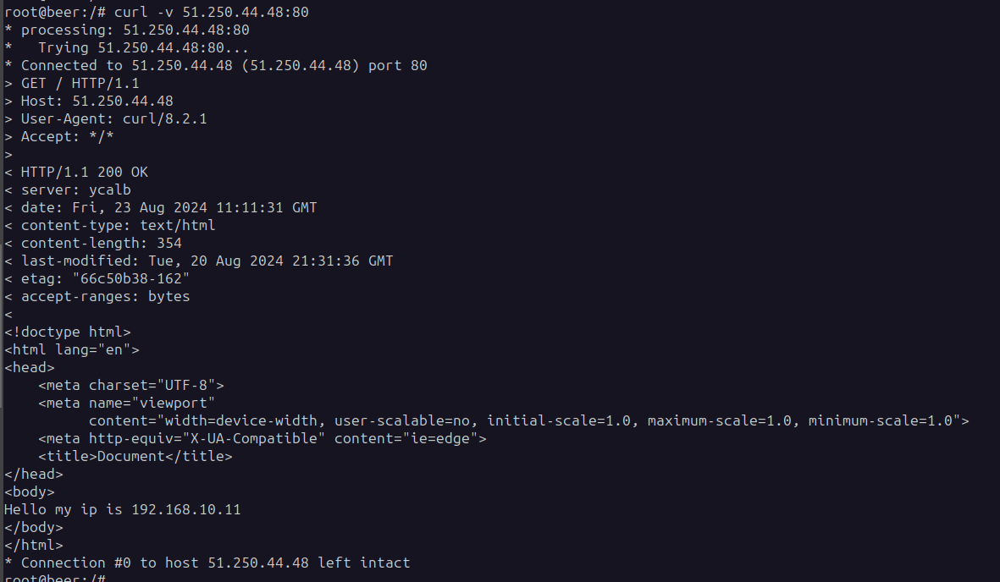
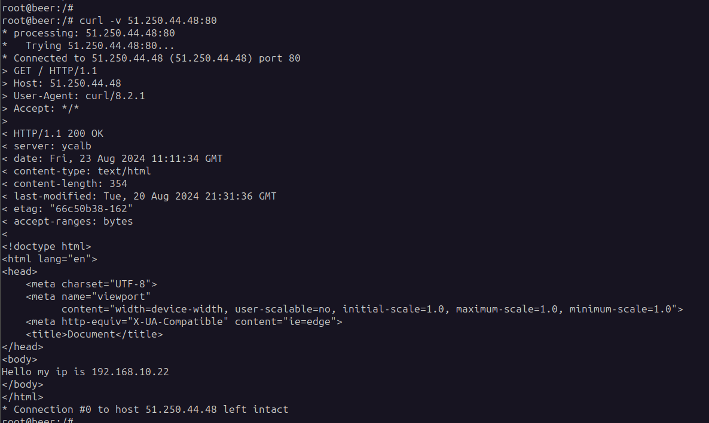
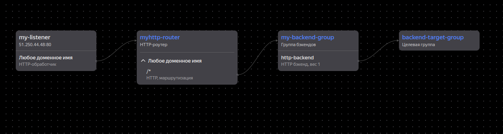
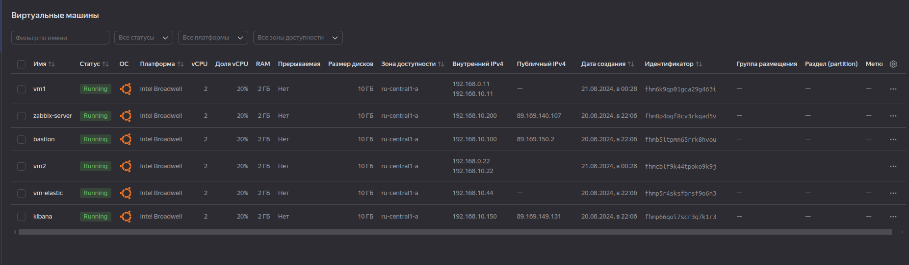
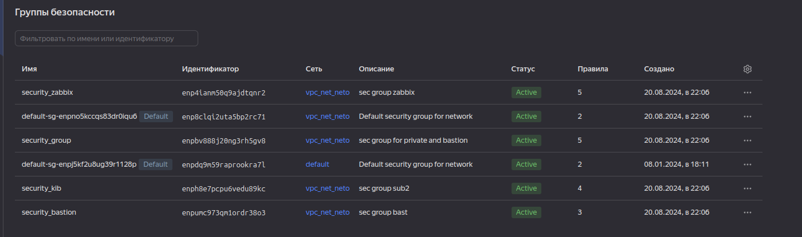
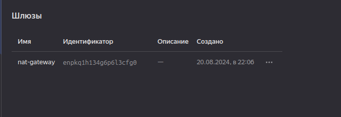
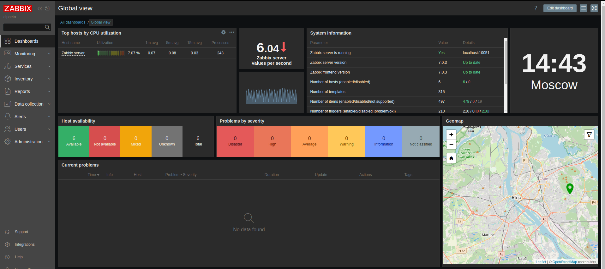
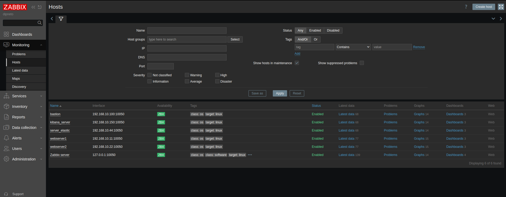
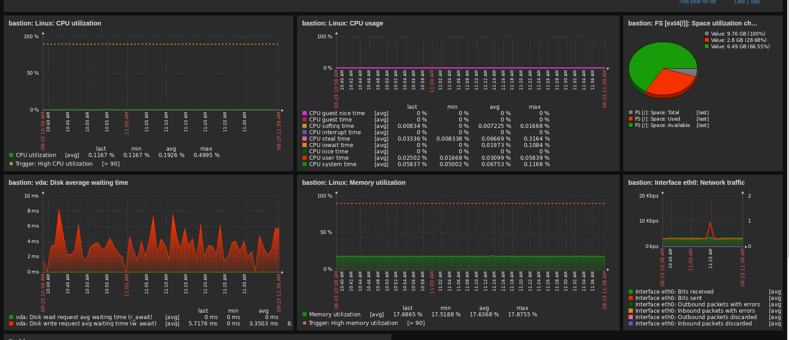
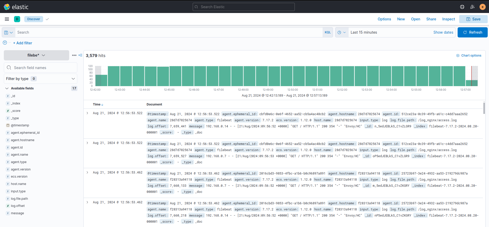

# Дипломная работа по профессии «Системный администратор»

В данной работе для развертывания инфрастурктуры я использовал Terraform и ansible

### Сайт 

* Для создания сайта с помощью ресурса "application load balancer" в Terraform 
  я создал Load Balancer c "белым" ip адресом за которым скрываются два 
  web-сервера с "серыми" ip адресами 192.168.10.11 и 192.168.10.22. На две
  этих ВМ я поместил в /var/www/html два файла с ip-адресами этих ВМ. Файлы 
  эти заполняются адресами динамически, т.е. подстраиваются под "серый" адрес ВМ.
  Т.е. при обращении да адрес "load balancer" мы должны будем видеть два разных адреса 
  этих ВМ	

* Так же приклдываю карту балансировки load balancer из личного кабинета в "YK"

	
### Сеть 

* Был развернут один VPC, в рамках которого были развернуты Сервера web, Elasticsearch
  Zabbix, Kibana, application load balancer, а так-же bastion-сервер для взаимодействия с ВМ.

* Сервера web, Elasticsearch поместите в приватные подсети, а сервера Zabbix, Kibana, 
  application load balancer были определины в публичную подсеть.

* Так-же была настроена Security Groups для сервисов и NAT-шлюз.

### Мониторинг 

* На сервер развернутый через Terraform с помощью ansible был установлен zabbix-сервер 

* C помощью ansible установил zabbix-agent на кажудю вм и уже в самом zabbix насторил покдлючение
  к серверам с zabbix-agent и dashbord

### Логи 

###### Для хранение я отображение логов от web-cерверов были развернуты два сервера 

* Сервер elasticsearch для хранения, поиска и анализа больших объемов данных в реальном времени

* Сервер kibana для отображения логов который подключается к elasticsearch 

* Также на каждый из web-серверов был развернут filebeat для сбора логов из nginx и отправки в 
  elasticsearch

